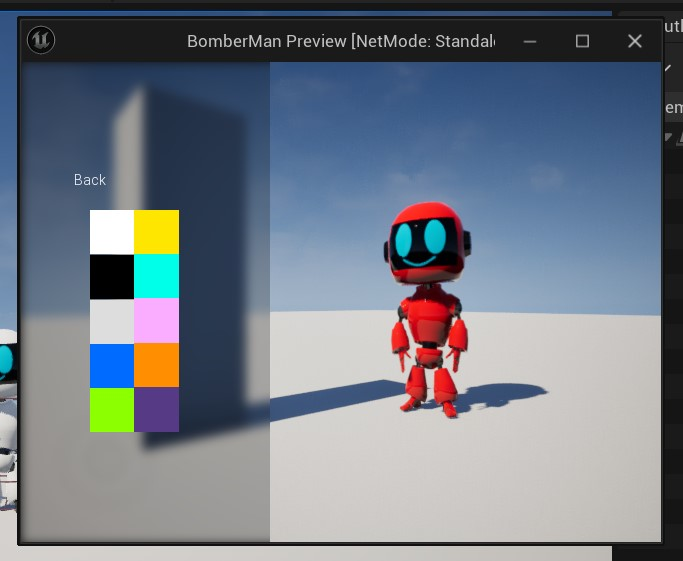
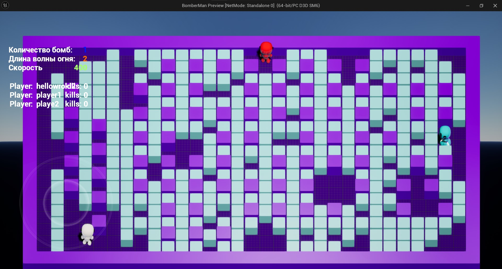
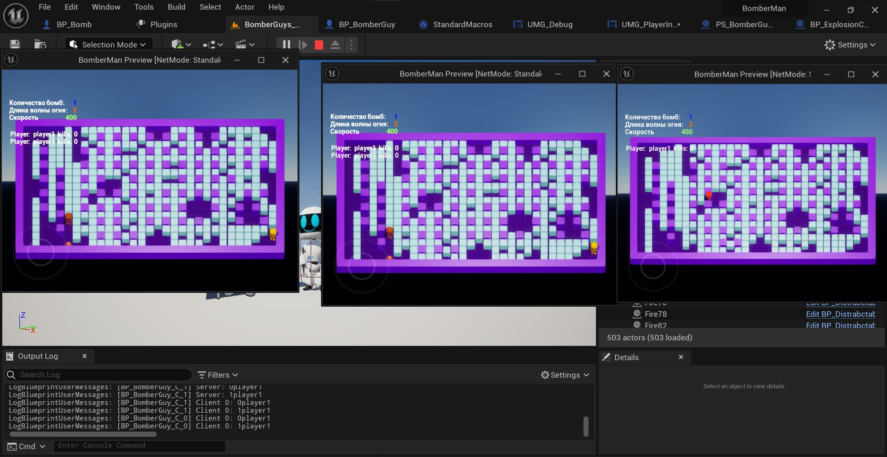

UE5.3 plugin with basic bomberman game

To use this plugin:
copy this repository to your ./Plugins folder in your projects folder
1. Set GI_BomberGuys in your project settings
2. Set GM_BomberGuys in your project settings

